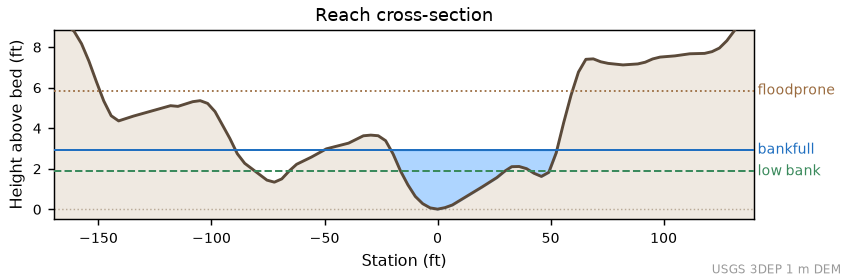
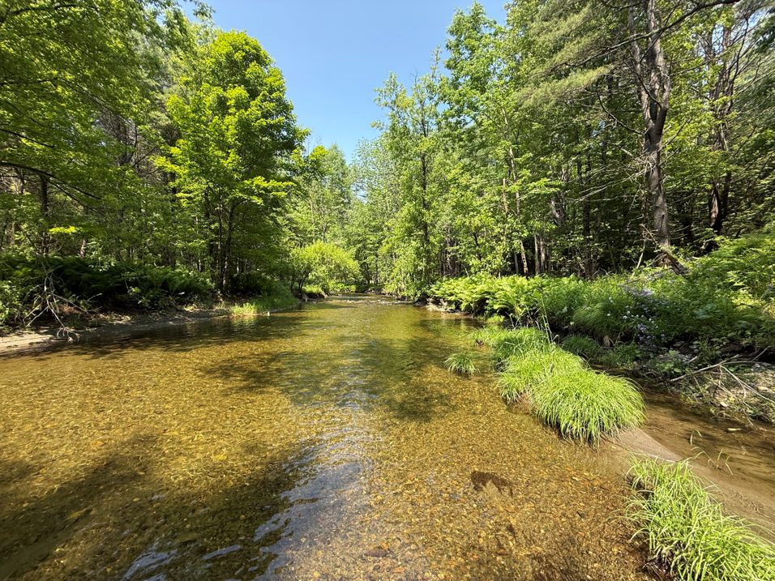
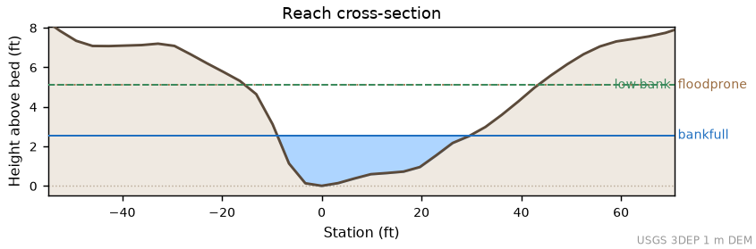
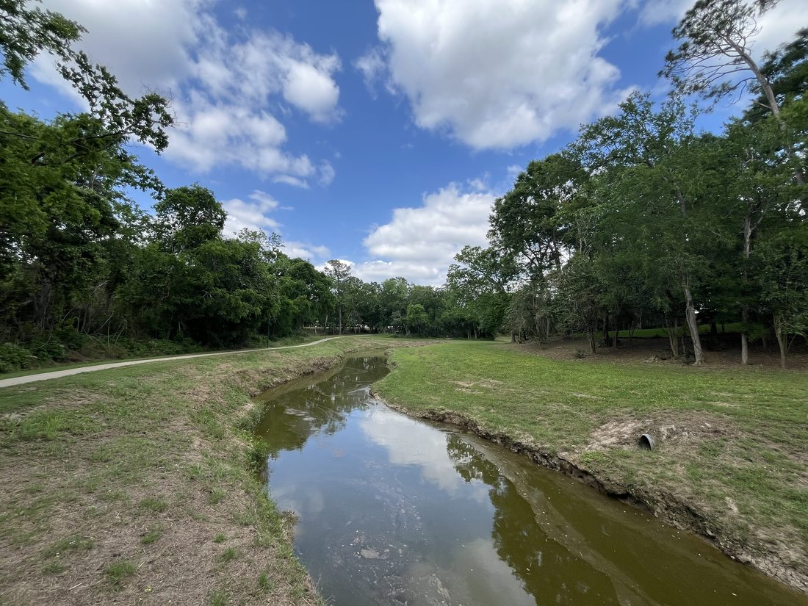
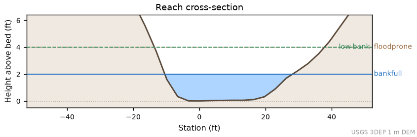
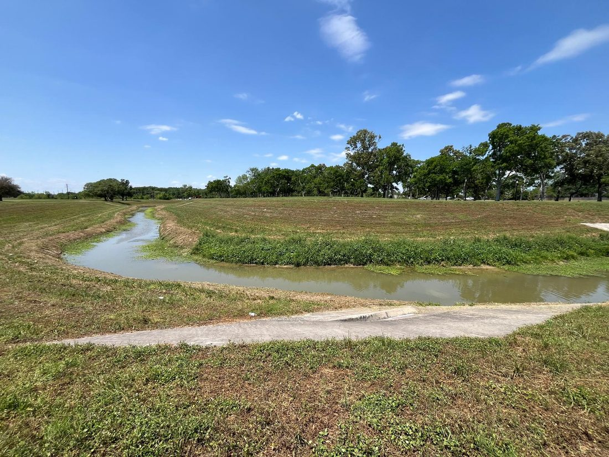
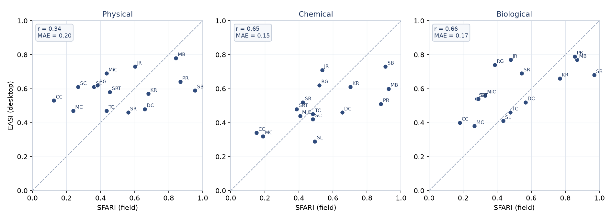

::: callout-note-soft
This document is the extended documentation for EASI. A shorter technical note
introduces the method for first-time readers (Stepchinski and Menichino In Review).
The EASI web application is available at
[usace-wrises.github.io/staf/easi](https://usace-wrises.github.io/staf/easi/).
:::

# Introduction

Stream assessments inform restoration design, regulatory permitting, mitigation
crediting, and long-term monitoring (Palmer and Filoso 2009, Doyle and Shields
2012). Many methods are available, and they vary widely in the functions they
cover and the effort they require, which makes their results difficult to compare
(Stepchinski et al. 2025a, Stepchinski et al. 2025b). To organize this range of
effort, the Stream Tiered Assessment Framework (STAF) describes three tiers of
assessment: Screening, Rapid, and Detailed (Stepchinski et al. In Review b). The
Screening tier uses low effort and accepts higher uncertainty. It relies on
desktop data and takes minutes to hours per site, which suits watershed screening
and early planning. The Rapid tier uses moderate effort and focused fieldwork.
The Detailed tier uses surveys, data collection, and modeling to support final
design and crediting.

EASI is the Screening tier of STAF. It evaluates a comprehensive set of stream
functions for wadeable streams across the conterminous United States, drawing
entirely on public national data services. EASI scores on the NHDPlus Version 2
stream network, the network the national landscape datasets describe. The map
shows the full National Hydrography Dataset, and a stream mapped only at high
resolution is handled by a fixed substitution rule: EASI scores the nearest
covered reach downstream, labels the substitution in the report, and declines
to score when that reach drains more than ten times the selected stream's area.
EASI is semi-quantitative, so it is
useful for screening many sites, evaluating alternatives, and tracking change
over time. Existing screening tools often cover only some stream functions or
apply only to certain regions. EASI was built to close that gap by compiling
widely used screening metrics into one consistent assessment that runs nationwide
(Stepchinski and Menichino In Review).

This document serves three purposes. First, it describes how EASI is
conceptualized, quantified, and applied. Second, it documents verification, which
asks whether the method behaves as designed and produces sensible results across
diverse conditions. Third, it documents validation, which asks whether EASI
estimates agree with independent field observations. The verification and
validation work reuses field data from the Stream Functions Assessment and Rapid
Index (SFARI), the Rapid tier of STAF (David et al. In Review). Because EASI and
SFARI share the same stream functions, SFARI field results provide a practical
field reference for EASI desktop estimates at the same locations. The document
structure follows the SFARI technical report so that the two tiers read as a
matched pair, at a lighter level of detail.

# Conceptualization

## Stream functions and functional categories

EASI is built on a single list of stream functions that applies across stream
types in the United States (Stepchinski et al. In Review a). The list synthesizes
established concepts, including the functional objectives of Fischenich (2006),
the Stream Functions Pyramid (Harman et al. 2012), and process-based restoration
principles (Beechie et al. 2010). For organization and communication, the
functions are grouped into five functional categories: hydrology, hydraulics,
geomorphology, physicochemistry, and biology. These categories follow the Stream
Functions Pyramid (Harman et al. 2012), which is widely used and supports
communication among practitioners.

EASI uses one screening metric per function. A single metric per function keeps a
complete assessment fast and repeatable, which is the central requirement of a
screening tier. The twenty functions and their categories are listed in
@sec-quantification.

## From functions to ecosystem condition

Stream functions do not act in isolation. A change in one function commonly
affects others and affects the physical, chemical, and biological condition of
the stream. EASI represents this structure by linking each function to one or
more outcomes, following Stepchinski et al. (In Review a). Each function has a
direct effect on the outcome it most strongly controls and, where supported by
the literature, indirect effects on the others. @tbl-outcomes shows the mapping
used in EASI.

| Functional category | Function | Physical | Chemical | Biological |
|---|---|:--:|:--:|:--:|
| Hydrology | Catchment hydrology | D | i | i |
| Hydrology | Surface water storage | D | i | i |
| Hydrology | Reach inflow | D | i | i |
| Hydrology | Streamflow regime | D | i | i |
| Hydraulics | Low flow and baseflow dynamics | D | i | i |
| Hydraulics | High flow dynamics | D | i | i |
| Hydraulics | Floodplain connectivity | D | i | i |
| Hydraulics | Hyporheic connectivity | D | i | i |
| Geomorphology | Channel evolution | D | i | i |
| Geomorphology | Channel and floodplain dynamics | D | i | i |
| Geomorphology | Sediment continuity | D | i | i |
| Geomorphology | Bed composition and large wood | D | i | i |
| Physicochemistry | Light and thermal regime | - | D | i |
| Physicochemistry | Carbon processing | - | D | i |
| Physicochemistry | Nutrient cycling | i | D | i |
| Physicochemistry | Water and soil quality | i | D | i |
| Biology | Habitat provision | - | - | D |
| Biology | Population support | i | i | D |
| Biology | Community dynamics | i | i | D |
| Biology | Watershed connectivity | i | - | D |

: Stream functions and their direct (D) and indirect (i) effects on physical,
chemical, and biological outcomes. A dash indicates no documented effect. {#tbl-outcomes}

The three outcomes, physical, chemical, and biological, together represent
overall ecosystem condition. Reporting condition in these three consistent
categories keeps results comparable across sites and across project phases, which
supports site selection for the Rapid and Detailed tiers.

# Quantification {#sec-quantification}

## Metrics

EASI assigns one screening metric to each of the twenty functions. Each metric resolves
one fixed automatic hierarchy: a connected field observation where one exists, then a
published model, then a named screening proxy. The metrics are listed by discipline in
@tbl-metrics-hydrology through @tbl-metrics-biology. For each metric, the tables give
its function, the automated method, its inputs and equation, the exact Good, Fair, and
Poor breakpoints, the basis for those breakpoints, the source hierarchy, and the known
limitations.

These tables are generated from `data/screening-methods.json`, the same catalog the
evaluator scores from, so the documented breakpoints cannot differ from the ones applied
(the documentation build regenerates them on every run). Breakpoints described as
provisional are STAF screening transitions, not evidence of an ecological threshold.
Breakpoints described as published carry the citation recorded in the catalog's
citation register.











Metrics are computed from established national sources. These include the EPA
StreamCat landscape summaries, USGS 3DEP elevation data, the EPA Water Quality
Portal, the EPA ATTAINS impaired-waters database, the USACE National Inventory of
Dams, and the USGS Nonindigenous Aquatic Species database. Channel geometry is
estimated from a 3DEP cross section using regional bankfull curves (Bieger et al.
2015) selected by physiographic division (Fenneman and Johnson 1946), together
with the entrenchment and bank-height ratios of Rosgen (1996). Because some
metrics are national proxies, any metric rating can be overridden with field
evidence or more detailed data, which updates the scores.

The eight watershed metrics come from one of two engines, and the framework,
not the user, decides which. On the NHDPlus V2 network the StreamCat lookup
engine supplies them: precomputed EPA StreamCat summaries keyed by the reach
COMID, fast and citable by vintage. On any other NHD stream, which the map
draws as a cyan line, the STAF site engine delineates the exact watershed at
the clicked point on the high-resolution NHD and computes the same quantities
from NLCD, TIGERweb roads, the National Inventory of Dams, SSURGO soils and
EROM flow. On those streams the three reach-keyed metrics, low flow, substrate
and biological integrity, depend on EPA evidence that exists only per V2 reach,
so they come from the nearest covered reach downstream, labeled with the routed
distance and the drainage-area ratio, and are unavailable when that reach
drains more than ten times the clicked stream. Every rating in the report and
the exports says which engine produced it. Whether the site engine should also
answer covered streams was a question for the score-level equivalence study
(StreamCat inputs against engine inputs at the same sites), not a setting. It
reported on 2026-09-02 that the engines are not interchangeable at the
rating level (agreement 0.84 over 30 NRSA sites against a 0.90 bar, with the
condition class agreeing at 0.97), so covered streams stay on the lookup
engine and the approximation is stated here.

Several fallback methods classify published 0 to 1 integrity or probability
values into Good, Fair, and Poor at 0.70 and 0.40, and the modeled benthic
probability at 0.67 and 0.33. These are EASI integration tiers. The source
datasets publish no condition cutpoints, so EASI applies one consistent
convention across its fallbacks and labels it in every scoring trace. The
tiers sit below the national median watershed integrity value of about 0.79,
so a Good from a fallback should be read as the absence of strong landscape
pressure rather than confirmed good condition.

## Channel geometry

Four metrics read the channel cross section: floodplain engagement and bank
condition through the bank-height ratio, floodplain access through the
entrenchment ratio, and channel evolution through the worse of the two. The
cross section comes from the best available 3DEP elevation model (1 m where
published, otherwise the 10 m seamless layer). EASI cuts nine transects
perpendicular to the reach between 15 and 85 percent of its length, samples
each at 10 m spacing, and selects a representative transect for scoring.
Bankfull width and depth come from the regional curves noted above.

The low-bank elevation that sets the bank-height ratio is found by a slope-break
rule. Walking outward from the deepest point, a candidate bank must first climb
at least 0.3 m and at least 25 percent of the bankfull depth. The bank is then
the first point whose next 3 m of profile is flat, meaning the average grade
ahead is below 5 percent and below 25 percent of the steepest climb crossed so
far. The lower of the two sides governs, and a side that never breaks (a valley
wall) contributes nothing. These constants are screening conventions. A computed
bank-height ratio below 1.0 triggers a geometry check in the scoring trace, and
the cross section is editable in the report, which recomputes all four geometry
metrics from the edited stages.

## Scoring

Each metric is rated Good, Fair, or Poor against the published thresholds in the
discipline tables (@tbl-metrics-hydrology through @tbl-metrics-biology). A rating
of Good indicates condition at or near reference for that metric. Fair indicates
a moderate departure. Poor indicates a substantial departure. In the web
application these ratings are assigned automatically from the underlying data,
and an assessor can override any rating with field evidence.

Each rating maps to a function score on a 0 to 15 scale. A rating maps to the
midpoint index of its range, and the function score is that index multiplied by
15 and rounded. This gives 13 for Good, 8 for Fair, and 3 for Poor. Function
scores of 11 to 15 indicate a Functioning state, 6 to 10 indicate a
Functioning-at-Risk state, and 0 to 5 indicate a Non-Functioning state.

The index values behind those scores (0.85, 0.545, and 0.195) are the midpoints
of the three STAF condition bands (0.70 to 1.0, 0.40 to 0.69, and 0 to 0.39),
which places each rating at the center of its band on both scales. The
midpoint is the unbiased representative of a band when only the band is known,
which is the screening situation by design.

## Aggregation

Function scores are combined into three outcome sub-indices for physical,
chemical, and biological condition. Each function contributes to the outcome it
directly affects with a weight of 1.0 and to outcomes it indirectly affects with
a weight of 0.1, following @tbl-outcomes. Each sub-index is the weighted sum of
its function scores divided by the maximum possible weighted sum, which places it
on a 0 to 1 scale. The three sub-indices are then averaged into the overall
Ecosystem Condition Index. A sub-index or index value of 0 to 0.39 indicates
Non-Functioning condition, 0.40 to 0.69 indicates Functioning-at-Risk condition,
and 0.70 to 1.0 indicates Functioning condition.

The indirect weight of 0.1 is a STAF convention. A sensitivity sweep run for
the 2026-08 review varied it across its full range and found site rankings
essentially unchanged (rank correlation at least 0.975) with no condition-class
changes except at the extreme of removing indirect effects entirely, which
supports keeping the convention as stated.

# Application

EASI is a web application that runs in a browser and requires no installation,
accounts, or data subscriptions. The user works through four named steps.

1. **Identify.** The user pans a national map and clicks a stream. The click
   snaps to the mapped stream line from the National Hydrography Dataset.
2. **Basin.** The application delineates the contributing watershed and an
   upstream assessment reach, then reports the drainage area, the reach length,
   and the stream identifiers. The assessment reach extends a standard 1000 ft
   upstream of the selected point and can be adjusted before delineation.
3. **Assessment.** The application computes and scores the twenty metrics, then
   presents each function with its metric, the scoring method behind it (inputs,
   breakpoints, and the resulting rating), and the source that supplied the
   evidence. An assessor can override any rating, edit the channel cross
   section, and attach notes.
4. **Report.** The report shows the function scores, the physical, chemical,
   and biological sub-indices, the overall Ecosystem Condition Index, the
   editable channel cross section, and the full metric table. Results can be
   exported as PDF, CSV, or GeoJSON.

Because EASI is a screening tool, every rating can be overridden. An assessor who
has field data or more detailed information can replace a rating, and the scores
update immediately. This keeps EASI useful as a first pass that a Rapid or
Detailed assessment can later refine.

# Verification and testing

Verification asks whether the method behaves as designed and produces sensible
results across the range of streams it is meant to cover. We verified EASI in two
ways. First, we ran EASI across a national set of field sites that span a wide
range of stream sizes, settings, and condition. Second, we examined individual
sites in detail to confirm that the metric results and the cross-section geometry
match what is known about each reach.

## Coverage across diverse sites

We ran EASI at the verification sites used by SFARI. These sites were selected to
span ecoregions, stream orders, drainage areas, and land use, from small forested
headwaters to large rivers and from least-disturbed reaches to heavily developed
urban channels. @tbl-coverage lists the sites and the resulting EASI Ecosystem
Condition Index next to the SFARI field value. EASI computed all twenty functions
at every site, which confirms that the method runs end to end across this range
of conditions.



## Worked verification cases

Three sites are presented in detail. They were chosen to contrast a
least-disturbed New England headwater with two developed streams on the Gulf
Coastal Plain. For each site we show the EASI cross section, a field photograph,
and the EASI function ratings next to the SFARI field ratings.

### Mink Brook, New Hampshire {#sec-case-mb}

Mink Brook near Hanover, New Hampshire (43.6899, -72.2840, NHD COMID 9327030) is
a third-order stream in a largely
forested watershed. Field review confirms a stable, well-connected channel with
good floodplain access. The desktop cross section underestimated bankfull height
at this reach, which drove the automated High flow dynamics and Channel evolution
ratings too low. Following the override workflow that EASI is designed to support,
these two functions, together with Floodplain connectivity, were set to Good to
reflect the field condition. This is the kind of expert correction the screening
tier expects when field evidence is available. @fig-xs-mb shows the EASI cross
section and @fig-photo-mb shows the reach.

{#fig-xs-mb width=85%}

{#fig-photo-mb width=70%}



### Cowart Creek, Texas {#sec-case-cc}

Cowart Creek is a low-gradient, second-order stream on the Gulf Coastal Plain
near Houston, Texas (29.5189, -95.1929, NHD COMID 1563096), in a heavily developed
watershed. Both EASI and SFARI rate
this reach as Non-Functioning, consistent with its incised channel, sparse
riparian cover, elevated nutrients, and impaired status. @fig-xs-cc shows the
EASI cross section and @fig-photo-cc shows the reach.

{#fig-xs-cc width=85%}

{#fig-photo-cc width=70%}



### Marys Creek, Texas {#sec-case-mc}

Marys Creek is a first-order stream on the Gulf Coastal Plain near Houston,
Texas (29.5458, -95.2644, NHD COMID 1562892), also in a developed watershed. As with Cowart Creek, EASI and SFARI agree
on Non-Functioning condition. @fig-xs-mc shows the EASI cross section and
@fig-photo-mc shows the reach.

{#fig-xs-mc width=85%}

{#fig-photo-mc width=70%}



# Validation

::: {.callout-note}
## Statistics current as of 2026-08-20

The statistics in this section were computed with the metric configuration
adopted in the 2026-08 defensibility review, from a fresh run of all 17 sites
with service data pulled on 2026-08-20. One caution from that work: paired
same-day requests returned different catchment-scale StreamCat components at
one site, which changed two fallback ratings there. Small differences in the
agreement statistics are within the noise of the underlying services. To
refresh these results, re-run the site corpus and the build
(`python scripts/build_docs.py --all`, network, about ten minutes).
:::

Validation asks whether EASI estimates agree with independent observations of
stream condition. We used the SFARI field assessments as the reference. SFARI is
the Rapid tier of STAF and is based on focused fieldwork, so its results provide
an independent, field-based measure of the same stream functions that EASI
estimates from desktop data (David et al. In Review). Because the two methods
share the same function list, we can compare them at three levels: the overall
Ecosystem Condition Index, the three outcome sub-indices, and the individual
functions.

## Data and methods

EASI was run at each SFARI site using only the site coordinates. SFARI field
results were taken from the SFARI verification dataset. Both methods report
function scores on a 0 to 15 scale and report sub-indices and the Ecosystem
Condition Index on a 0 to 1 scale, so the two are directly comparable without
rescaling. We compared the methods with scatter plots against a one-to-one line,
with the Pearson correlation and mean absolute difference, and with agreement on
the three condition classes (Non-Functioning, Functioning-at-Risk, Functioning).

Two points about the data should be stated plainly. First, the SFARI dataset
contained two rows whose scores exactly duplicated another site. These were
treated as data-entry duplicates and were excluded from the quantitative
comparison, although EASI was still run at those locations for the coverage
table. Second, the Mink Brook case applied an expert override to two functions,
as described in @sec-case-mb. The override is noted wherever Mink Brook appears
so that it does not silently improve the agreement.



## Ecosystem Condition Index

@fig-val-eci compares the EASI and SFARI Ecosystem Condition Index across sites.
Points near the one-to-one line indicate agreement.

{#fig-val-eci width=70%}

## Outcome sub-indices

@fig-val-sub compares the physical, chemical, and biological sub-indices.

{#fig-val-sub width=95%}

## Function-level agreement

@fig-val-func summarizes agreement for each shared function. SFARI Planform
change and EASI Bed composition and large wood have no counterpart in the other
method, so nineteen of the twenty functions are compared.

{#fig-val-func width=90%}

## Classification agreement

@tbl-val-class shows how often EASI and SFARI place a site in the same condition
class for the Ecosystem Condition Index.



## Interpretation

EASI is a screening tool, so the goal of validation is not exact agreement with
field results. The goal is to confirm that EASI separates streams in good
condition from streams in poor condition and that it does so for the right
reasons. The comparisons above should be read in that light. Where EASI and SFARI
diverge, the difference often points to a function that depends on field
observation, which is exactly where the override workflow and the higher STAF
tiers add value.

# Limitations

EASI is a desktop screen, and its limits follow from its data. They are stated
here so results are read at the right strength. The override workflow and the
Rapid and Detailed tiers are the designed responses to each of them.

- **Most evidence is landscape data.** At the 17 verification sites, StreamCat
  variables supplied 11 of 20 ratings on average, and removing them would move
  7 of 17 sites across a condition class. EASI results carry the strengths and
  the blind spots of national landscape summaries.
- **Connected field evidence is rare.** The source hierarchy prefers a
  connected NRSA observation, but qualifying evidence supplied only about three
  ratings across all 17 verification sites. In practice most ratings come from
  StreamCat, the elevation model, WQP, ATTAINS, NAS, and NID.
- **One cross section drives four physical functions.** The bank-height and
  entrenchment ratios come from a single representative DEM transect, usually
  at 10 m resolution. Dropping those four ratings shifts the mean index by
  about 0.04 and changes 3 of 17 site classes, so verifying or editing the
  cross section is the highest-value check an assessor can make.
- **Three-bin ratings compress the index.** Every metric scores 0.85, 0.545,
  or 0.195, so extreme sites pull toward the middle. Across the verification
  sites the EASI index spans about 0.40 to 0.77 while the paired field values
  span 0.15 to 0.94. EASI ranks and screens rather than measures.
- **Upstream services are not perfectly repeatable.** Paired same-day runs
  returned different catchment-scale StreamCat components at one site. Ratings
  built on fallback components can shift between runs without any change in
  the stream.
- **Streams outside the StreamCat network are assessed differently.** Their
  watershed metrics come from the STAF site engine's exact watershed rather
  than from StreamCat, which usually takes well under a minute (up to about five
   minutes on a large basin) rather than seconds and can refuse a
  basin past its budget, and their reach-keyed metrics describe the nearest
  covered reach downstream. The verification sites all sit on the covered
  network; the two engines' equivalence on covered streams was the subject
  of a separate 30-site study, which found the ratings agree at 0.84 and the
  condition class at 0.97, so covered streams stay on the lookup engine.
- **A Good band is not a no-effect finding.** Sensitive macroinvertebrate taxa
  decline well below the 10 percent impervious boundary, and naturally
  fine-bedded streams can rate Poor on substrate by nature. The per-metric
  limitations in the catalog state these cases where they apply.

# Summary

EASI is the Screening tier of STAF. It estimates the condition of wadeable
streams across the conterminous United States from national data, organizes the
results into physical, chemical, and biological outcomes, and reports an overall
Ecosystem Condition Index. This document described how EASI is conceptualized,
quantified, and applied, and it reported verification and validation against
SFARI field results at sites that span the country. EASI ran end to end at every
site and produced condition estimates that track the field assessments. The
2026-08 defensibility review anchored the metric thresholds to published
sources where they exist and labeled the remaining screening judgments. Continued
work will expand the validation dataset, examine regional thresholds, and extend
the web application as additional national datasets become available.

# References

::: {#refs-manual}
Beechie, T. J., D. A. Sear, J. D. Olden, G. R. Pess, J. M. Buffington, H. Moir,
P. Roni, and M. M. Pollock. 2010. Process-based principles for restoring river
ecosystems. BioScience 60: 209-222.

Bieger, K., H. Rathjens, P. M. Allen, and J. G. Arnold. 2015. Development and
evaluation of bankfull hydraulic geometry relationships for the physiographic
regions of the United States. Journal of the American Water Resources Association
51 (3): 842-858.

David, G. C. L., D. E. Somerville, J. M. McCarthy, S. D. MacNeil, F. Fitzpatrick,
R. Evans, and D. Wilson. 2021. Technical Guide for the Development, Evaluation,
and Modification of Stream Assessment Methods for the Corps Regulatory Program.
Washington, DC: U.S. Army Corps of Engineers.

David, G. C. L., L. M. Stepchinski, S. R. Wiest, and G. T. Menichino. In Review.
Stream Functions Assessment and Rapid Index (SFARI). Technical Report, Ecosystem
Management and Restoration Research Program. Vicksburg, MS: U.S. Army Engineer
Research and Development Center.

Doyle, M. W., and F. D. Shields Jr. 2012. Compensatory mitigation for streams
under the Clean Water Act: Reassessing science and redirecting policy. Journal of
the American Water Resources Association 48 (3): 494-509.

Fenneman, N. M., and D. W. Johnson. 1946. Physical Divisions of the United States
(map, 1:7,000,000). Reston, VA: U.S. Geological Survey.

Fischenich, J. C. 2006. Functional Objectives for Stream Restoration. EMRRP
Technical Note SR-52. Vicksburg, MS: U.S. Army Corps of Engineers.

Harman, W., R. Starr, M. Carter, K. Tweedy, M. M. Clemmons, K. Suggs, and C.
Miller. 2012. A Function-Based Framework for Stream Assessment and Restoration
Projects. Washington, DC: U.S. Environmental Protection Agency.

Palmer, M. A., and J. D. Allan. 2006. Restoring rivers. Issues in Science and
Technology 22 (2): 40-48.

Palmer, M. A., and S. Filoso. 2009. Restoration of ecosystem services for
environmental markets. Science 325 (5940): 575-576.

Rosgen, D. L. 1996. Applied River Morphology. Pagosa Springs, CO: Wildland
Hydrology.

Stepchinski, L., S. K. McKay, and G. T. Menichino. 2025a. Review of Stream
Assessments for Evaluating Ecological Impacts and Benefits. Technical Note,
Ecosystem Management and Restoration Research Program. Vicksburg, MS: U.S. Army
Engineer Research and Development Center.

Stepchinski, L. M., S. K. McKay, A. E. Harris, and G. T. Menichino. 2025b. A
review of stream assessment methods in the United States. Journal of the American
Water Resources Association. https://doi.org/10.1111/1752-1688.70056.

Stepchinski, L. M., S. K. McKay, and G. T. Menichino. In Review a. A Synthesis
and Inventory of Stream Functions. River Research and Applications.

Stepchinski, L. M., S. K. McKay, and G. T. Menichino. In Review b. A Tiered
Approach to Developing Function-Based Stream Assessments. Journal of the American
Water Resources Association.

Stepchinski, L. M., and G. T. Menichino. In Review. Ecosystem Assessment Screening
Index (EASI). ERDC/TN EMRRP-26-DRAFT. Vicksburg, MS: U.S. Army Engineer Research
and Development Center.

Wohl, E., B. P. Bledsoe, R. B. Jacobson, N. L. Poff, S. L. Rathburn, D. M.
Walters, and A. C. Wilcox. 2015. The natural sediment regime in rivers:
Broadening the foundation for ecosystem management. BioScience 65 (4): 358-371.
:::

# Appendix: full site comparison {.appendix}

@tbl-appendix reports every verification site with its EASI and SFARI Ecosystem
Condition Index and sub-indices. Duplicated SFARI rows are marked.


